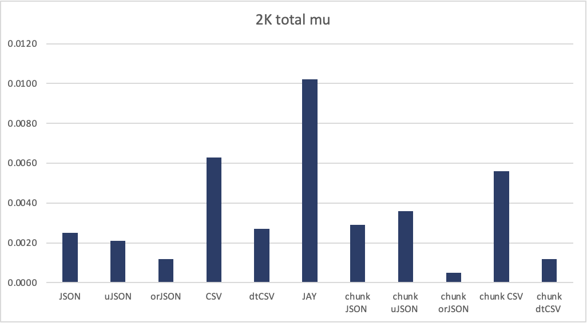
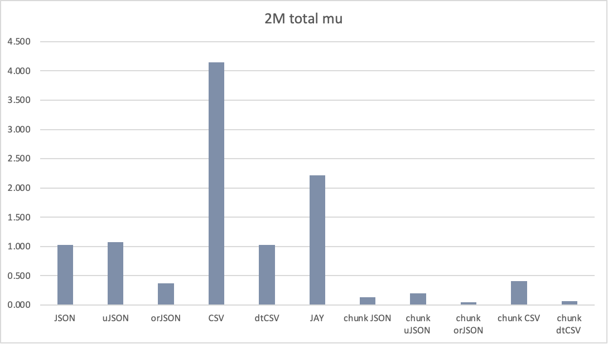
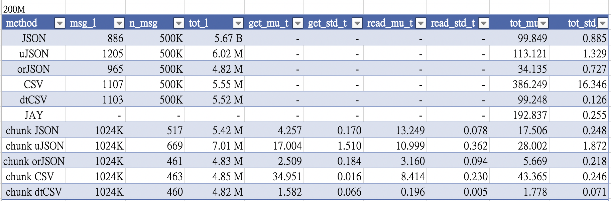

# grpc-df-transfer
Transfer dataframe through grpc with some efficient way

## requirements

- grpcio
- grpcio-tools
- flask

- requests
- numpy
- pandas

- ujson
- orjson
- datatable

## generate files and grpc proto

### generate dataframe

1. run `gen.py` to generate 2K, 2M and 200M files into `data/` folder

2. run `python3 -m grpc_tools.protoc -I. --python_out=. --grpc_python_out=. df.proto` to generate grpc python code

### Run transmission test

1. run `server.py` to start a grpc server
2. run `client.py` to get the results

#### Detail of tests

There are two kinds of transfer strategys.

1. split into rows
Split the whole dataframe into small pieces row by rows.  
Encode each small pieces into data pieces and transfer them.  

Process: pd.DataFrame --> row-by-row data --> encoded row data --> **transfer** --> encoded row data -> row-by-row data -> whole data

2. chunked dataframe
Encode the whole data using one encoded strategy.  
Split the whole encoded data into small data chunks and transfer them.  

pd.DataFrame --> encoded data --> chunked data --> **transfer** --> chunked data -> encoded whole daat -> whole data

And we use some different packages:
- [ujson](https://github.com/ultrajson/ultrajson)
- [orjson](https://github.com/ijl/orjson)
- [datatable](https://github.com/h2oai/datatable)

You can choose them in the `client.py` file.

## Results

如同之前一樣所有方法執行 5 次取平均（200M 為 3 次）  
只貼出總共花費時間的平均值(total_mu_t) 的圖表  
詳細數據可以在附檔 .xlsx 查看

### 2K

orJSON 表現出色，只花費 csv 20% 或 json 50% 的時間

### 2M

因為 message 量增加，chunked 的方法表現超越 row-by-row  
dtCSV 表現追上 orJSON

### 200M

chunked 方法已全面超越 row-by-row  
dtCSV 則表現比 orJSON 更好，chunked dtCSV 成為最快的方法

### 200M table

orJSON 主要是 read 比普通 json 來得短非常多  
dtCSV 的讀寫速度則是來到另一個境界