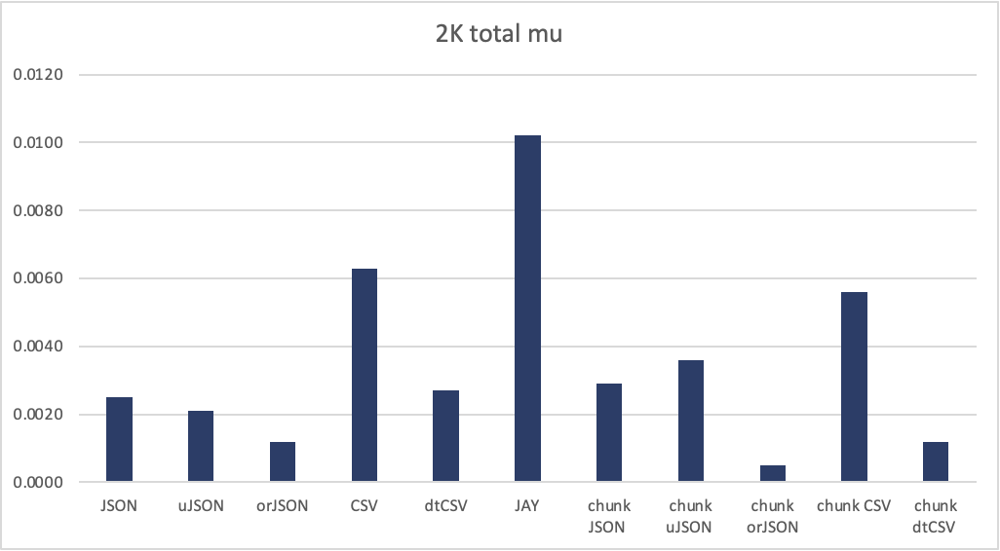
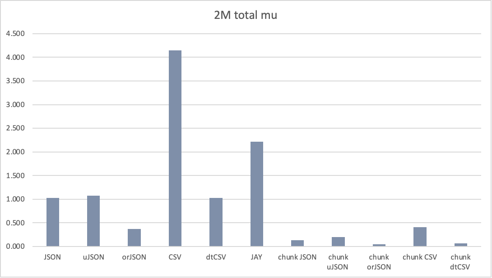
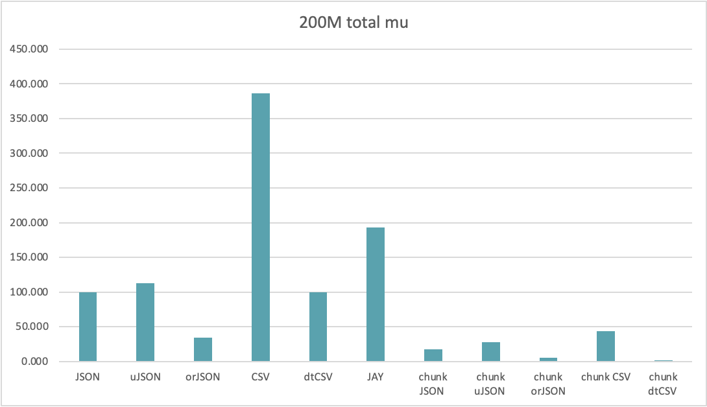

## 測試不同檔案大小之傳送速度

### 情境

因為每個 cell 需要是 8 Bytes，我把每個欄位都設為 double(float64) (100%)  
@betty_cy_tsai 如有需要 mixed 請再跟我說，但結果應該差不多  

檔案大小共測了 2K(5 rows ), 2M(5000 rows) and 200M(500000 rows)  
原先是要測 2G，不過速度太慢因此先暫停

並且 200M 實驗的 n_run 從 5 次降低至 3 次，略微影響精準度，不過影響不大

### 新套件

每次在網路上都可以看到別人推薦更快的 json 套件  
（說不定以後傳輸可以考慮直接用 C++ 的 grpc） 
所以我試了 `orJSON` 這個新套件 [](https://github.com/ijl/orjson)  
表現在相當不錯

code 部分長得略有不同
```python
values = np.ascontiguousarray(self.df.values) # get value from df (require contiguous array)
for i in range(self.df.shape[0]):
    v = values[i] 
    s = orjson.dumps(v, option = orjson.OPT_SERIALIZE_NUMPY) # plugin numpy serialization to orjson
    yield data_wrapper(s.decode()) # output of orJSON is binary, apply .decode() to string
```

實際上執行的動作比普通 json 更多一些
在 message 短的狀況下表現非常驚人，message 長度 900 時，速度約為原始 json 3 倍


### 實驗結果

如同之前一樣所有方法執行 5 次取平均（200M 為 3 次）  
只貼出總共花費時間的平均值(total_mu_t) 的圖表  
詳細數據可以在附檔 .xlsx 查看  

#### 2K file



orJSON 表現出色，只花費 csv 20% 或 json 50% 的時間

#### 2M file



因為 message 量增加，chunked 的方法表現超越 row-by-row  
dtCSV 表現追上 orJSON


#### 200M file



chunked 方法已全面超越 row-by-row  
dtCSV 則表現比 orJSON 更好，chunked dtCSV 成為最快的方法  

#### 200M excel table


orJSON 主要是 read 比普通 json 來得短非常多  
dtCSV 的讀寫速度則是來到另一個境界


----------------------------------------------------------------

≠
